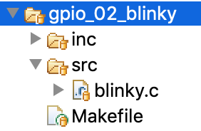

# Documentación Trabajo Práctico N° 1

**Seminario de Electrónica: Sistemas Embebidos**

**LPC43xx Entradas y Salidas (Digitales) de Propósito General (GPIO)**

Objetivo:
- Uso del IDE (edición, compilación y depuración de programas)
- Uso de GPIO (manejo de Salidas y de Entradas Digitales)
- Documentar lo que se solicita en c/ítems

Alumnos:
- Chaparro, Raúl Antonio (96222)
- García, Fernando (97770)
- Rovito, Juan Francisco (84948)
  

## Punto 1. Uso del IDE (Integrated Development Environment) MCUXpressoenes

### Estructura de Archivos
Los proyectos de ejemplo están ubicados dentro de la carpeta:

	firmware_v2\sapi_examples

Allí encontramos una carpeta con documentación orientada al mapeo de periféricos para la EDU CIAA en

	firmware_v2\sapi_examples\documentation

Por otro lado encontramos la carpeta

	firmware_v2\sapi_examples\edu-ciaa-nxp

 Allí encontramos todos los proyectos de ejemplo para la EDU-CIAA separados por proyectos desarrollados con "código puro", con "máquinas de estado" y con "RTOS" (sistemas perativos de tiempo eal)

	firmware_v2\sapi_examples\edu-ciaa-nxp\bare_metal
	firmware_v2\sapi_examples\edu-ciaa-nxp\statecharts
	firmware_v2\sapi_examples\edu-ciaa-nxp\operating_systems

Analizaremos los proyectos dentro de **bare-metal**:

**Internal Peripherals**

- Data types.
- Peripheral Map.
- ISR Vector.
- Board.
- Tick.- GPIO.- UART.
- ADC.- DAC.- I2C.
- RTC.- Sleep.
- PWM.

**Delays**
- Delay.

**External Peripherals**
- 7-segment display.
- Keypad.
- Angular Servo (0 to 180°).
- Magnetometer (compass) sensor HMC5883L.

Dentro de GPIO encontramos el _gpio_02_blinky_

Estructura de archivos dentro del proyecto:

Dentro de **src** se encuentran los archivos de código de programa (.c)

Dentro de **inc** se encuentran los archivos header (.h)

El archivo **Makefile** del proyecto. Se declaran los siguientes flags:

- Nombre del proyecto (PROJECT_NAME)
- Ubicación de los módulos, dependiendo de micro que usará (PROJECT_MODULES)
- modules/$(TARGET)/sapi
-
- Ubicación de

  

### Secuencia de Comandos

Una vez abierto el proyecto en cuestión, se deberá:

1. Ir a la pestaña "Proyect" ----> "Clean".
2. Luego "Project" ----> "Build project".

Para realizar el _debug_ se debe ir al ícono de "_debug_" y luego colocar la opción "_debug configurations_".

Una vez realizada la configuración del _debug_, hay que  _click_ al  botón _debug_ para realizarlo.  Luego, con las teclas F5 y F6 se podrá  el paso a paso ingresando o no a las funciones. Con F5 (_Step into_) Se ingresa a las funciones y con F6 (_Step over_) se ejecutan línea a línea sin entrar a cada función.

### Parpadeo de LEDs c/sAPI

__Pasos de Migración__

Se crea la carpeta

	firmware_v2\projects\TP1

Allí se copia todo el contenido de la carpeta

	firmware_v2\sapi_examples\edu-ciaa-nxp\bare_metalgpio/gpio_02_blinky

Luego se debe modificar el archivo

	firmware_v2\project.mk

comentando la línea que indica el proyecto a compilar y agregando la siguiente línea:

	PROJECT = projects/TP1

__Funciones sAPI para el parpadeo de un led__

Para realizar el parpadeo de un led, el programa “_blinky.c_” utiliza 2 funciones: "_gpioWrite( )_" que está definida en en el archivo “_sapi_gpio.c_” y “_delay( )_” que está definida en el archivo “_sapi_delay.c_”.

A _gpioWrite()_, se le pasa como argumentos una variable de tipo “_gpioMap_t_” que indica el LED sobre el que se va a actuar y una variable de tipo “_bool_t_” que indica si se quiere prender o apagar el LED . _gpioMap_t_ es de tipo enum y está definida en el archivo “_sapi_peripheral_map.h_”; en el código _blinky.c_ se quiere prender el led azul, por eso a _gpioWrite()_ se le pasa el parámetro “LEDB”. _gpioWrite()_ usa dos funciones llamadas “_gpioObtainPinConfig()_” , que se encuentra definida en el archivo sapi_gpio.c, y “_Chip_GPIO_SetPinState()_” que se encuentra definida en el archivo “_gpio_18xx_43xx.h_”.

La función _gpioObtainPinConfig()_ se utiliza para obtener la dirección del port y el pin que se desea modificar a partir del parámetro que le indicamos como argumento a _gpioWrite()_, en nuetro caso es LEDB. Para dicho cometido la función _gpioObtainPinConfig()_ hace uso de una tabla. El uso de este tipo de tablas permite la portabilidad del código entre distintos microcontroladores.

La función _Chip_GPIO_SetPinState()_ recibe tres argumentos, un puntero a una estructura de tipo “LPC_GPIO_T”, la cuál se encuentra definida en el archivo _gpio_18xx_43xx.h_, dos variables de tipo “_uint8_t_” que indican el port y el pin del LED sobre el cuál se quiere actuar y una variable de tipo “bool” llamada “setting” que va a determinar si se debe apagar o pender el LED. El argumento que recibe como dicho puntero es una macro llamada “_LPC_GPIO_PORT_”, que indica la dirección en la memoria del microcontrolador dónde inician los registros que permiten leer y escribir los pines de entrada y salida de los puertos. De forma tal que luego, mediante la expresión:

	pGPIO->B[port][pin] = setting;

Se consigue escribir la dirección de memoria específica que cambia el estado del pin que se quiere modificar.

## Punto2: Sensado de Push buttons c/SAPI

### Ítem a
Para migrar el proyecto se deben seguir los siguientes pasos:
 * Copiar la carpeta gpio_01_switches_leds al repositorio local TP1 creado previamente en el paso anterior.
 * En el archivo _project.mk_, se debe comentar con el "#" la línea del ejemplo utilizado, y agregar **PROJECT = projects/TP1**.
 * Se debe crear un archivo TP1.c en la carpeta: firmware_v2\projects\TP1\src.
 * En este archivo además de incluir al _header_ sapi.h se debe  crear:
	+ `` #define TP1_1 ``
	+ `#define TP1_2`
* Luego se agrega  `#define test TP1_x`, donde x representa que ejemplo se quiere compilar, pudiendo ser en este caso TP1_1 o TP1_2.
* Por último se realiza una compilación condicional `#if (TEST == TP1_x)..... #endif`  evaluando el valor de TEST. Para el caso de TP1_1 se copia el código del ejemplo _blinky_, mientras que para el caso TP1_2 se copia el código de _switching_leds_.

 ### Ítem b

A continuacioón se documentará el ejemplo del TP1_2 ya que el TP1_! se documentó en puntos anteriores.
En el ejemplo con poulsadores, nuevamente se incluye el _header_ sapi.h. En la función principal **main( )** se realiza la configuración  de la placa (por medio de la función **boardConfig( )**). Luego, se realiza la configuración de **GPIO0** y **GPIO1** como entrada y salida respectivamente (con la función **gpioConfig( )**). Al **GPIO0**, que es el puerto **p6_1** (pin 74 del micro) se le asigna la **FUNC0** que es el **GPIO03[0]**, mientras que al **GPIO1** es el **P6_4** se le asigna la **FUNC0** que es **GPIO3[3]** (pin 80 del micro).
Una vez configurados los gpio, se define una variable booleana  valor y se entra en bucle infinito. dentro de este bucle, leé las entradas (las teclas  **TEC_x**) con la función **gpioRead( )**.
Esta función tiene como argumentos un tipo **gpioMap_t** (en este caso, los valores serían **TEC_1**, **TEC_2**, **TEC_3**, **TEC_4**,**GPIO0**). En esta función, luego de declarar algunas variables, se llama la función **gpioObtainPinConfig( )** , para obtener los parametros de puertos, pines y función de cada gpioMap_t y luego a **Chip_GPIO_ReadPortBit( )**. Esta última función tiene como parámetros un puntero del tipo LPC_GPIO_T, el puerto del GPIO y el pin (en este caso al ser TEC_1 el puerto y el pin serían GPIO0[4]). El tipo **LPC_GPIO_T** es una estructura de los puertos GPIO. Lo que se pasa es un puntero a esta tipo de estructura, que ya esta definida. A partir de este puntero se mape con el valor del _puerto_ y _pin_ al argumento B del puerto y pin de **TEC_x**. El valor devuelto se traduce a un tipo bool_t (_ON_ _OFF_) y se guarda en la variable valor. Este valor devuelto se escribe en la función **gpioWrite( )**, para prender el led correspondiente si se apreto alguna de las teclas.
Los puertos leidos y y usados son:
- TEC_1 (GPIO0[4]) y se actua sobre LEDB(GPIO5[2])
 - TEC_2 (GPIO0[8]) y se actua sobre LED1(GPIO0[14])
- TEC_3 (GPIO0[9]) y se actua sobre LED2(GPIO1[11])
- TEC_4 (GPIO1[9]) y se actua sobre LED3(GPIO1[12])
- GPIO0 (GPIO03[3]) y se actua sobre GPIO3(GPIO3[0])
### Ítem c
A continuación se muestra la estructura de datos al _debbugear_ el código. Como se puede ver, el valor de pin es "GPIO0" y tiene como pinNamePort = 6, pinNamePin=1, func=0, gpioPort=3, gpioPin=0, como ya se hizo mensión.

Por otra parte si se quiere encender el LED 2, se debe tocar el pulsador número 3. En la próxima iamgen se muestran los puertos y pines de la tecla **TEC_3** y como su valor es de 0. 

Esto hace que el valor (_value_) de LED2 sea 1, como se muestra a continuación.

Para encender el led se usa la función **gpioWrite( )** y al entrar se puede ver que el valor _setting_ es **TRUE**, provocando el seteo del led.

<h2 id="punto-3-uso-de-tickhooks-csapi">Punto 3: Uso de tickHooks c/sAPI</h2>

### Funciones sAPI para el uso de interrupciones

El objetivo del código del archivo "_tickHook.c_" es realizar un parpadeo de LEDs mediante el uso de interrpciones.

En este ejemplo, nuevamente se incluye el header "_sapi.h_". 

Luego se define una función llamada "_MyTickHook()_". Esta es la función ligada a la interrupción. Se va a configurar para que se ejecute cada 50 ms. A esta función se le pasa un puntero a "_void_", el cual se parsea para que sea del tipo "_gpioMap_t_". Esta variable va a indicar cual es el LED que se desea parpadear. El encendido o apagado del LED se realiza mediante la función "_gpioWrite()_". La lógica de la función hace que si el LED estaba prendido se apague y que si estaba apagado se prenda.
En la función principal "_main( )_" se realiza la configuración  de la placa (por medio de la función "_boardConfig( )_"). La función _main()_ llama a "_tickConfig()_", "_tickCallbackSet()_" y "_delay()_".

Primero llama a la función _tickConfig()_ y le pasa como parámetro 50. Esta función sirve para configurar que la interrupción se ejecute cada 50 ms. La función _tickConfig()_ en realidad es una macro, la función que realmente se ejecuta se llama "_tickInit()_", la cual está definida en el archivo "_sapi_tick.c_". Esta función valida el parámetro que se le pasa como argumento, escala el parámetro para convertirlo en "cantidad de ticks" y se llama a otra función llamada "_SysTick_Config()_". Lo que hace esta función es modificar los valores de específicos de la memoria del microcontrolador para cargar el contador de la interrupción con la "cantidad de ticks", setear la prioridad de la interrupción y habilitar la interrupción.

Luego a la función _tickCallbackSet()_, la cual también está definida en el archivo _sapi_tick.c_. A esta función se le pasa el nombre que tiene la función que se ejecuta cuando se interrumpe y otro parámetro que en este caso sirve para indicar qué LED se va a modificar. Estos dos valores son asignados a las variables "_tickHookFunction_" y a "_callBackFuncParams_". La primera indica la función que se va a ejecutar durante la interrupción, mientras que la segunda corresponde al parámetro que se le pasa a dicha función.

En el _main()_ se observa como se manipula a la función _tickCallbackSet()_ haciendo uso de un _while()_ para cambiar el LED que parpadea cada 1 segundo.

## Punto 4: Uso de tickHooks &amp; LEDs c/sAPI

### Utilidad de la constante "_tickRate_MS_"

Al inicio del código se configura la interrupción mediante la "_tickConfig()_" cuya funcionalidad fue descrita anteriormente. _tickRate_MS_ es una macro, se la puede hacer valer 1, 10 o 100. Se le pasa esta macro a la función _tickConfig()_ como argumento. La utilidad de esto es que dentro de la función "_main()_" se ejecute un condicional dado por un "_if()_" a intervalos regulares según el valor de _tickRate_MS_.

### Utilidad de la constante "_LED_TOGGLE_MS_"

LED_TOGGLE_MS es otra macro que va a determinar el período de parpadeo del LED. Si _tickRate_MS_ vale 1, el led va a prenderse y apagarse cada 100 ms, 500 ms o 1000 ms, según sea que LED_TOGGLE_MS valga 100, 500 o 1000 respectivamente.

## Punto 5: Envío de mensajes de depuración por puerto serie c/sAPI

La diferencia de este punto con el anterior es que en este punto se mandan mensajes de depuración por el puerto serie. Para este cometido se hace uso de dos funciones, "_debugPrintConfigUart()_" y "_debugPrintString()_".

La función _debugPrintConfigUart()_ se encarga de realizar la inicialización de la comunicación serial para depuración. Como argumentos se le pasa una macro llamada "_UART_USB_" que indica que se va a utilizar la UART 2 del microcontrolador para conectarse via USB para realizar una depuración, y se le pasa el baud rate de la comunicación.

La función "_debugPrintString()_" se va a encargar de enviar una cadena de caracteres a través de la UART. La función hace uso de una función llamada "_uartWriteString()_" la cual se encuentra definida en el archivo "_sapi_uart.c_". A su vez hace uso de otra función llamada "_uartWriteByte()_" definida también en el mismo archivo. A su vez hace uso de otras dos funciones que operan a bajo nivel modificando las posiciones de memoria del microcontrolador asociadas al manejo de la UART, una se encarga de determinar si la UART está disponible para el envío de datos y la otra a escribir los datos para realizar el envío.

## Punto 6: Sensado de Push Buttons c/sAPI
En caso que no funcione correctamente el ejemplo de aplicación documentar la forma de la señal digital “pulsador” a sensar: no oprimido // transición a oprimido // mantener oprimido // transición a no oprimido) // …
